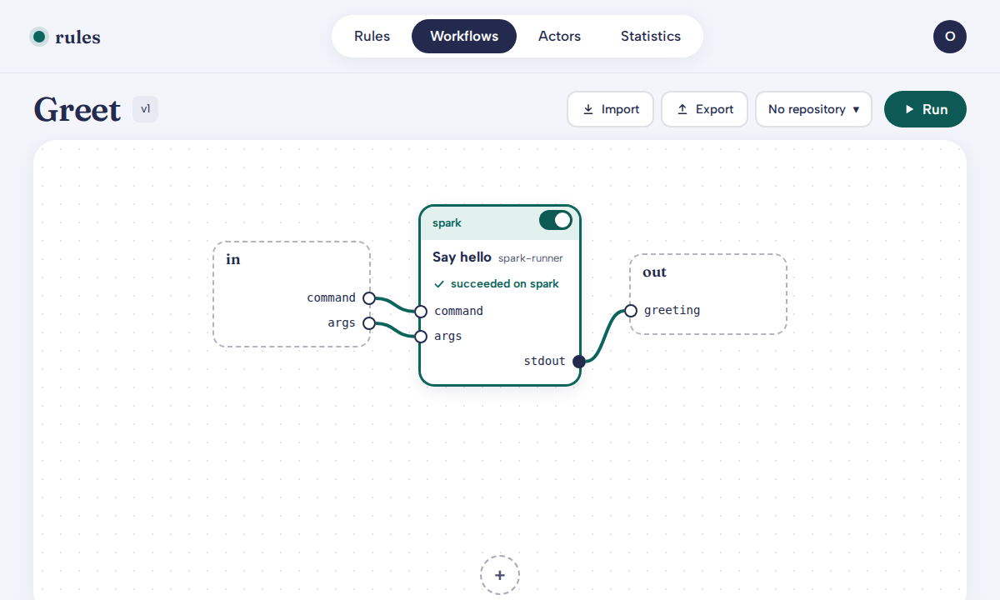
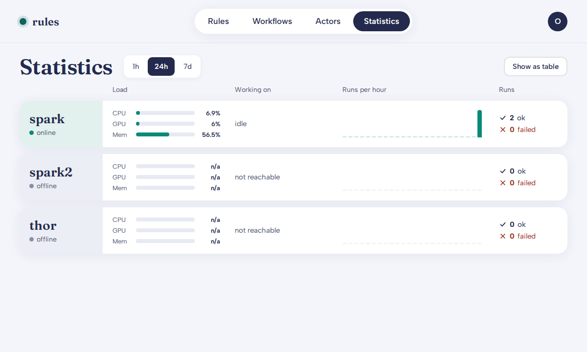
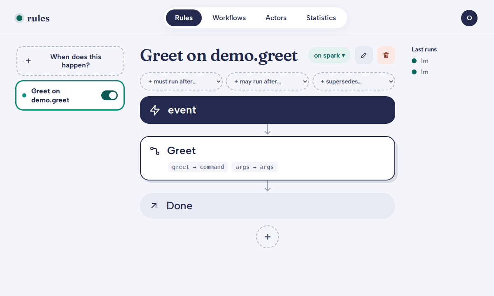

# Demo: the after-state, end to end, on one machine

This script reproduces the spec's after-state
([`docs/specs/2026-10-03-culture-rules-engine-editor.md`](specs/2026-10-03-culture-rules-engine-editor.md))
locally. The operator builds a rule as **Trigger → Condition → (Workflow) →
Action** by composition, places it and each step by machine or actor,
toggles it on, and watches the run light up the graph and the Statistics
lanes. Agents do the same over the CLI and MCP. Redundant hosts keep the
service up.

Every command below was executed against a real MongoDB replica set and the
real API and engine node. Output is pasted and trimmed (`...` marks cuts).
The run used a worktree checkout on a laptop-style single host, so a few
clauses are demonstrated differently from production. See
[What this demo does not show](#what-this-demo-does-not-show).

| Clause of the after-state | Where it is shown |
|---------------------------|-------------------|
| From rules.culture.dev (SSO) | [Step 2](#2-serve-the-api) shows dev identity; SSO is in [`operations/rules-culture-dev.md`](operations/rules-culture-dev.md) |
| builds a rule as Trigger → Condition → (Workflow) → Action | [Step 5](#5-an-actor-a-workflow-and-a-rule) |
| places it and each step by machine, actor or requirement | [Step 4](#4-enrol-machines) and [Step 5](#5-an-actor-a-workflow-and-a-rule) |
| toggles it on | [Step 6](#6-replay-then-enable) |
| watches runs light up the graph and the Statistics lanes | [Step 8](#8-the-web-tabs) |
| agents do the same over CLI/MCP | every step is a CLI verb; [`culture-rules mcp`](#9-the-mcp-server) serves the same verbs |
| stopping any one host does not stop the service | [Step 10](#10-redundancy) |

## 0. Prerequisites

- `uv`, Docker with the `mongo:8.0` image, `openssl`, and (for the web
  step) Node.js.
- A checkout of this repo. All commands run from the repo root.

```bash
uv sync                                  # the dev group carries pymongo, fastapi, uvicorn
source .venv/bin/activate                # so `culture-rules` is on PATH
```

## 1. A MongoDB replica set

The store is MongoDB, always over TLS with authentication and a
least-privilege app user (the API refuses admin credentials). The
production topology is three voting hosts, described in
[`operations/replica-set.md`](operations/replica-set.md). For one machine,
[`docs/demo/mongo.sh`](demo/mongo.sh) starts a **single-node** replica set
with the same TLS and auth settings on port **27118** (never the
default 27017) and writes an `env.sh`:

```console
$ docs/demo/mongo.sh up /tmp/culture-rules-demo
mongo up on 127.0.0.1:27118; source /tmp/culture-rules-demo/env.sh
$ source /tmp/culture-rules-demo/env.sh
$ env | grep -o '^CULTURE_RULES_[A-Z_]*'
CULTURE_RULES_MONGO_URI
CULTURE_RULES_MONGO_TLS_CA_FILE
CULTURE_RULES_API_URL
```

(`MemoryStore` is the in-process store used by the test suite. It is not
reachable from the CLI, so the API and node need MongoDB.)

## 2. Serve the API

A laptop has no Cloudflare Access, so this uses the unauthenticated dev
identity. It is off by default and makes everyone an admin, so it is for a
laptop only. The CLI sends `CULTURE_RULES_IDENTITY`. In production the
loopback listener validates Cloudflare Access JWTs and the LAN listener
takes service tokens, see
[`operations/rules-culture-dev.md`](operations/rules-culture-dev.md).

```console
$ export CULTURE_RULES_INSECURE_DEV_IDENTITY=1 CULTURE_RULES_IDENTITY=ori
$ culture-rules serve --port 8791 --admin ori &
serving the culture-rules API on default host
INFO:     Application startup complete.
INFO:     Uvicorn running on http://127.0.0.1:8791 (Press CTRL+C to quit)
$ export CULTURE_RULES_API_URL=http://127.0.0.1:8791
$ curl -s $CULTURE_RULES_API_URL/health
{"status":"degraded","store":{"reachable":true,"schema_version":"1.0"},
 "heartbeat":{"age_s":null,"online":false},"executor":{"lag_s":0.0,"due_steps":0}}
```

`degraded` is honest: the store is reachable but no engine node has beaten
yet.

## 3. Writes are dry-run by default

Every write verb previews unless given `--apply`:

```console
$ culture-rules actors create --body @docs/demo/actor.json
dry-run: actors create would POST /actors
{ "verb": "actors create", "applied": false, "dry_run": true,
  "would": { "method": "POST", "path": "/actors", "body": { "id": "spark-runner", ... } },
  "hint": "re-run with --apply to commit" }
re-run with --apply to commit
```

Nothing was written; the first `--apply` write is in step 4.

## 4. Enrol machines

Machines are explicit records (not inferred from the tailnet). spark, thor
and spark2 are enrolled with their capabilities and roles:

```console
$ culture-rules machines create --apply --body '{"name":"spark","platform":"linux-aarch64","capabilities":["gpu"],"roles":["store_member","engine_node","runner"]}'
{ "verb": "machines create", "applied": true, "dry_run": false, "result": { "id": "spark", ... } }
$ culture-rules machines create --apply --body '{"name":"thor","platform":"linux-aarch64","capabilities":["gpu"],"roles":["store_member","engine_node","runner"]}'
$ culture-rules machines create --apply --body '{"name":"spark2","platform":"linux-x86_64","roles":["engine_node","runner"]}'
$ culture-rules machines list
3 item(s)
- spark enabled=True
- spark2 enabled=True
- thor enabled=True
```

## 5. An actor, a workflow and a rule

An **actor** is *who* does work. This one is a `runner` on spark with one
registered command (`greet`, an `echo`), because runners execute registered
commands only, with no shell and no inline script:

```console
$ culture-rules actors create --apply --body @docs/demo/actor.json
{ "verb": "actors create", "applied": true, "dry_run": false,
  "result": { "id": "spark-runner", "kind": "runner", "machine": "spark", ... } }
```

A **workflow** is *how*: typed inputs, one `actor_task` step placed on that
actor, and an explicitly exported output. It names no trigger
([`docs/demo/workflow.json`](demo/workflow.json)):

```console
$ culture-rules workflows create --apply --body @docs/demo/workflow.json
{ "verb": "workflows create", "applied": true, "dry_run": false,
  "result": { "id": "greet-flow", ... } }
```

A **rule** is *when*: it binds an `event` trigger (type `demo.greet`) to
the workflow, maps the workflow inputs from the event, ends in the required
`noop` action, and is placed on spark, so its trigger and condition are
evaluated there ([`docs/demo/rule.json`](demo/rule.json)):

```console
$ culture-rules rules create --apply --body @docs/demo/rule.json
{ "verb": "rules create", "applied": true, "dry_run": false,
  "result": { "id": "greet-on-event", ... } }
$ culture-rules rules list
1 item(s)
- greet-on-event enabled=True
```

Invalid definitions are rejected at save with the failing field. While
writing this demo the API answered
`rule failed validation (invalid, HTTP 422) [workflow.inputs.args: expected
string, got dict]` for a literal object, which is why `rule.json` maps
`args` from `trigger.data.args` by reference instead.

## 6. Replay, then enable

Rules, workflows, actors and steps all have enable and disable. A disabled
rule never fires. Toggle it off and on:

```console
$ culture-rules rules disable greet-on-event --apply
{ "verb": "rules disable", "applied": true, ... "result": { "id": "greet-on-event", ... } }
$ culture-rules rules enable greet-on-event --apply
{ "verb": "rules enable", "applied": true, ... "result": { "id": "greet-on-event", ... } }
```

Before trusting a rule, replay it against recorded events. This reports
what would fire and executes nothing (note `actions_executed: 0`); the
event is recorded in step 7:

```console
$ culture-rules rules replay
{
  "events": 1,
  "would_fire_count": 1,
  "would_fire": [
    { "event_id": "evt-001", "rule_id": "greet-on-event", "fire": true,
      "reason": "matched", "message": "matched", "by": [], "upstream": {} }
  ],
  "skipped": [], "unmatched": [],
  "actions_executed": 0
}
```

## 7. A rule fires from an event

Each host runs `culture-rules node run`, the engine node: heartbeat and
probe, ingest, evaluate the rules placed on that host, start runs, drive
steps. `--once` runs a single cycle.

In production events arrive from an
[events-cli](https://github.com/agentculture/events-cli) durable
subscription (the `events` extra), which the node drains into the `events`
collection. **events-cli is not installed on this machine**, so the node
says so and ingests nothing. To exercise the same path, the demo records one
envelope in the `events` collection exactly as ingest would
([`docs/demo/event.py`](demo/event.py)). A new trigger consumer pins the
current head of the change feed on its first poll (events from before a
trigger existed are never backfilled), so one baseline cycle runs first:

```console
$ culture-rules node run --once --host spark
no event source for spark: events-cli is not available (No module named 'events_cli'); install the optional extra: pip install 'culture-rules[events]'
no event source (events-cli missing): nothing is ingested
node spark: 1 cycle; ingested 0, evaluated 0, deferred 0, started 0, transitions 0, errors 0
$ python docs/demo/event.py evt-001 world
recorded evt-001
$ culture-rules node run --once --host spark
...
node spark: 1 cycle; ingested 0, evaluated 0, deferred 0, started 1, transitions 4, errors 0
```

`started 1` is the rule firing from the event. The run:

```console
$ culture-rules runs list
1 item(s)
- run-05dc360bddea2979d1d13bc1df0538c3 status=succeeded rule_id=greet-on-event
$ culture-rules runs show run-05dc360bddea2979d1d13bc1df0538c3
{
  "id": "run-05dc360bddea2979d1d13bc1df0538c3",
  "status": "succeeded",
  "history": [
    { "rev": 1, "host": "spark", "event": "started",       "step": null },
    { "rev": 2, "host": "spark", "event": "dispatched",    "step": "say" },
    { "rev": 3, "host": "spark", "event": "succeeded",     "step": "say" },
    { "rev": 4, "host": "spark", "event": "action_ready",  "step": "@action" },
    { "rev": 5, "host": "spark", "event": "dispatched",    "step": "@action" },
    { "rev": 6, "host": "spark", "event": "succeeded",     "step": "@action" },
    { "rev": 7, "host": "spark", "event": "run_succeeded", "step": null }
  ],
  "rule": { "id": "greet-on-event", "digest": "sha256:...", "definition": { ... } },
  "workflow": { "id": "greet-flow", "version": 1, "digest": "sha256:...", "definition": { ... } },
  "trigger": { "id": "evt-001", "kind": "event", "type": "demo.greet", "data": { "args": { "who": "world" } } },
  "inputs": { "command": "greet", "args": { "who": "world" } },
  "outputs": { "greeting": "hello world\n" },
  "steps": [
    { "key": "say", "status": "succeeded", "host": "spark",
      "outputs": { "stdout": "hello world\n", "stderr": "", "exit_code": 0 } },
    { "key": "@action", "status": "succeeded", "host": "spark" }
  ],
  ...
}
```

The run is **persisted state**: the pinned rule and workflow definitions
(with digests), per-step host and outcome, and the exported output. A run
is resumable after an engine restart without re-executing completed steps
(covered by the engine tests, not re-run here).
The same run can be started by hand, which is also the path to use when no
event source exists:

```console
$ culture-rules rules run greet-on-event --apply --trigger '{"kind":"event","type":"demo.greet","data":{"args":{"who":"manual"}}}'
{ "verb": "rules run", "applied": true, "dry_run": false,
  "result": { "id": "run-006f1e9fc5e441568fcd48d6eff9c055", ... } }
$ culture-rules node run --once --host spark
...
node spark: 1 cycle; ingested 0, evaluated 0, deferred 0, started 0, transitions 4, errors 0
$ culture-rules runs list
2 item(s)
- run-006f1e9fc5e441568fcd48d6eff9c055 status=succeeded rule_id=greet-on-event
- run-05dc360bddea2979d1d13bc1df0538c3 status=succeeded rule_id=greet-on-event
```

## 8. The web tabs

The wheel ships the built editor as `culture_rules/web_dist` and the API
serves it same-origin, so a pip install needs no Node. From a checkout,
build it once and link it where the API looks (both paths are gitignored):

```bash
(cd web && npm ci && npm run build)
ln -s ../web/dist culture_rules/web_dist     # then restart `culture-rules serve`
```

A browser at `http://127.0.0.1:8791/` then shows the five tabs, **Rules |
Workflows | Actors | Variables | Statistics**. (The dev identity is a header, so the
screenshots below were taken with Playwright sending
`X-Culture-Identity: ori`. Behind Cloudflare Access the browser needs
nothing.) Runs are shown in context, never as a tab.

The **Workflows** tab with the run overlay: the step shows which machine it
ran on and its outcome, sourced from the persisted run state
(`/workflows?id=greet-flow&run=<run id>`):



The **Statistics** tab, one lane per enrolled machine, with load, what is
running, runs per hour and 24h ok/failed. spark beat during step 7 and
reads online with its probed load. thor and spark2 never ran a node, so
they render **offline**. They are listed anyway:



The **Rules** tab, the rule as a focused flow:



## 9. The MCP server

`culture-rules mcp` (the `mcp` extra) serves the same verbs as MCP tools
over stdio, with the same dry-run default. It talks to the same API, so an
agent does exactly what steps 3 to 7 did. A stdio `initialize` handshake
against the running API returned `serverInfo: {"name":"culture-rules"}`.
Add it to an MCP client config:

```json
{ "mcpServers": { "culture-rules": { "command": "culture-rules", "args": ["mcp"],
  "env": { "CULTURE_RULES_API_URL": "http://127.0.0.1:8791" } } } }
```

The CLI/MCP parity test (`tests/test_surface_parity.py`) fails if a verb
exists on one surface and not the other.

## 10. Redundancy

On three hosts, spark is the preferred primary and thor and orin vote with
it (spark2 is a non-voting member), so any one host can stop. Each firing
and step is claimed by exactly one host through an idempotency key, so a
redundant host never double-executes. This is **not** reproduced here
(one machine), it is covered by the suite's two- and three-node chaos tests:

```bash
uv run pytest tests/multihost -q
```

## Clean up

```bash
kill %1                                   # the API started in step 2
rm culture_rules/web_dist                 # the symlink from step 8
docs/demo/mongo.sh down /tmp/culture-rules-demo
```

## What this demo does not show

- **SSO and the public hostname.** rules.culture.dev, Cloudflare Access JWT
  validation and service tokens are provisioned per
  [`operations/rules-culture-dev.md`](operations/rules-culture-dev.md). The
  demo uses the laptop-only dev identity.
- **A real event bus.** events-cli was not installed here, so the event was
  recorded directly in the `events` collection (step 7). The ingest,
  de-duplication and drain logic is exercised by the suite with a fake
  drain.
- **Several hosts.** The set, nodes and failover are single-host here
  (step 10).
- **A human actor, an agent actor, a `requirement` placement and the mesh
  report.** The model and engine support them. Only a runner actor is run
  here.
